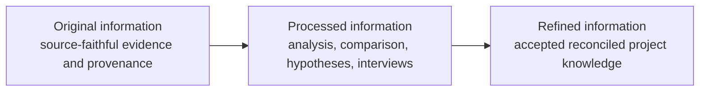
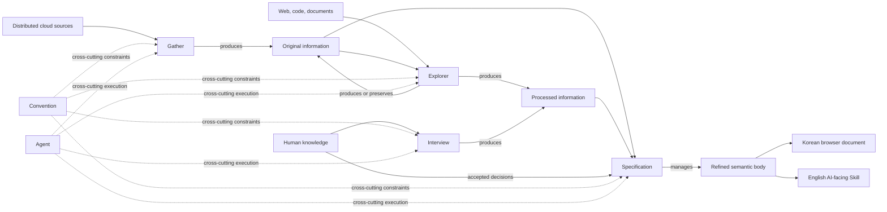
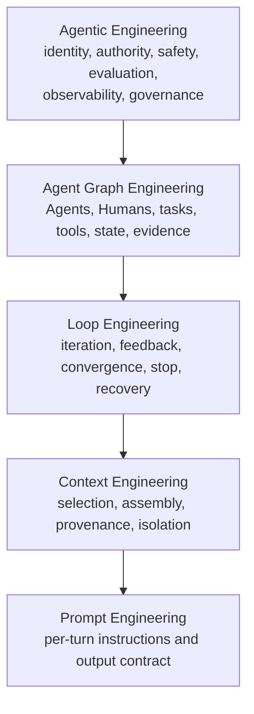
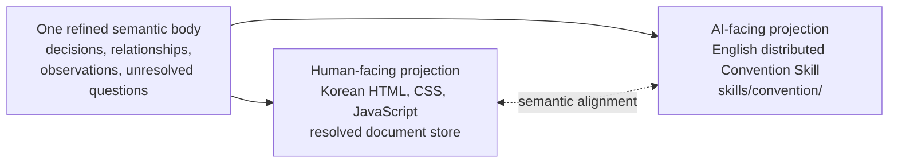
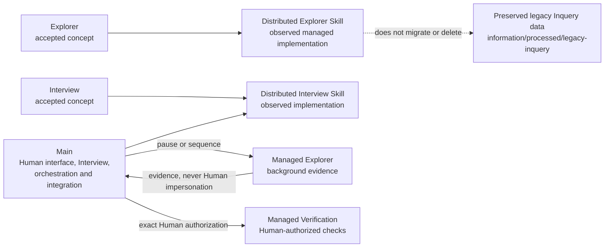
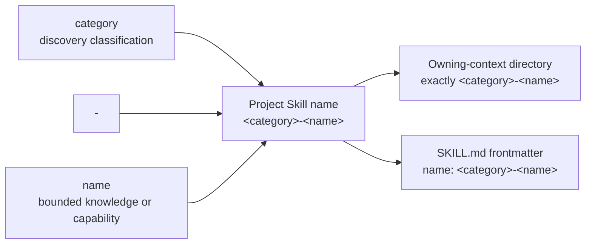
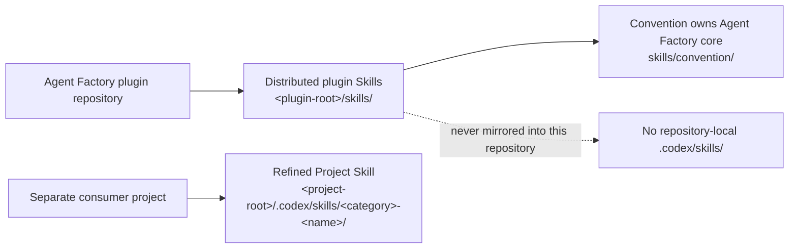
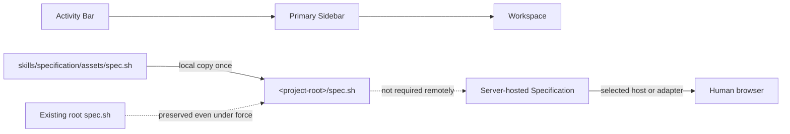

# Agent Factory Core Diagrams

These Mermaid sources are the AI-readable equivalents of the important visual
relationships rendered with semantic HTML and inline SVG in the paired Korean
browser document. Keep labels and relationships aligned when either
representation changes.

## Information lifecycle



## Core capability topology



## Agent engineering stack



## Paired representation alignment



## Current implementation relationships



## Project Skill naming



This relationship applies to newly named Skill identities where the owning
context requires the two-part form. Existing accepted identities are
preserved; it does not authorize bulk renaming.

## Skill ownership



## Storage-independent document roles

```mermaid
flowchart LR
    Roles[Logical information classes<br/>and document roles]
    Roles --> Local[Current/default local adapter<br/>.agent-factory/information/{original, processed, refined}]
    Roles --> Alternative[Explicitly resolved alternative<br/>project server, external store,<br/>mounted filesystem, configured backend]
    Requirements[Provenance, authority, isolation,<br/>alignment, accessibility, security]
    Requirements -. required for every adapter .-> Local
    Requirements -. required for every adapter .-> Alternative
    Alternative -. integration policy unresolved .-> Decisions[Configuration, identity, sync/conflicts,<br/>authentication, availability, caching]
```

## Human-facing Specification shell and launcher


