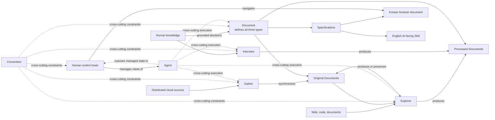
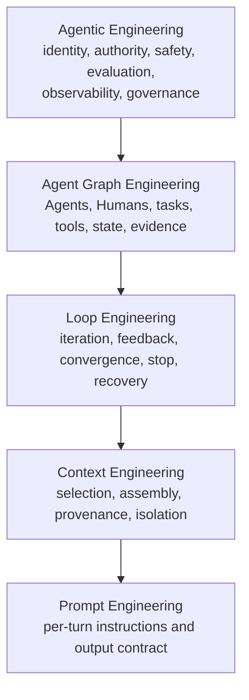
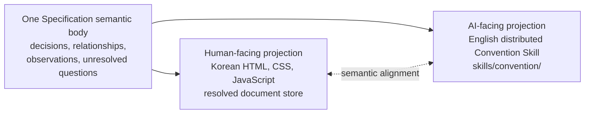
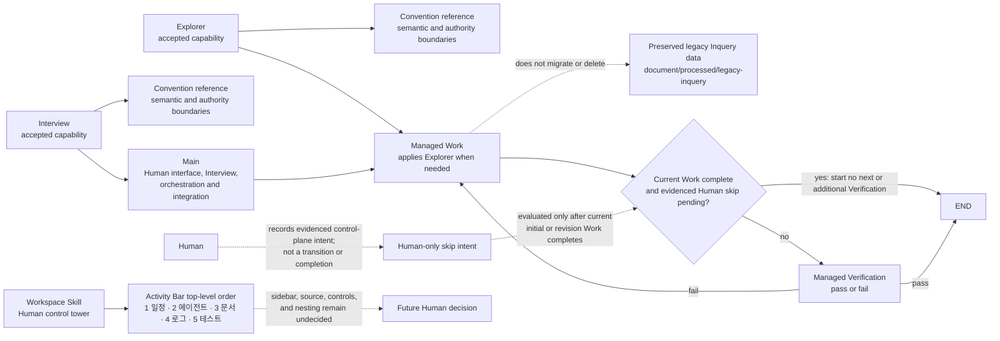
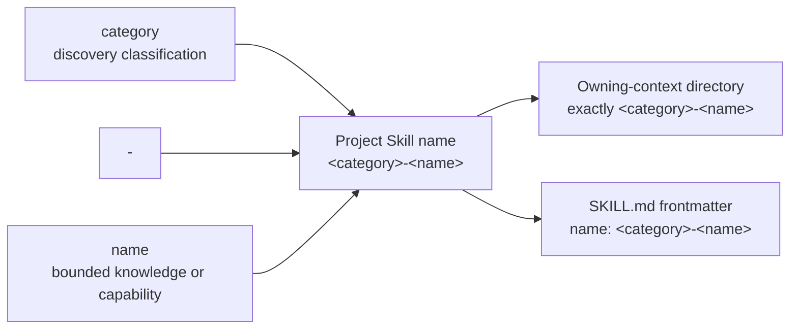
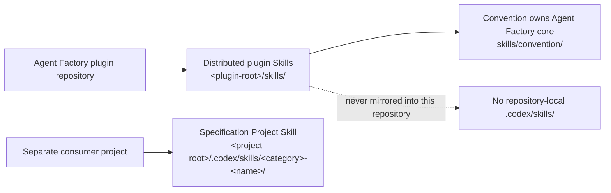
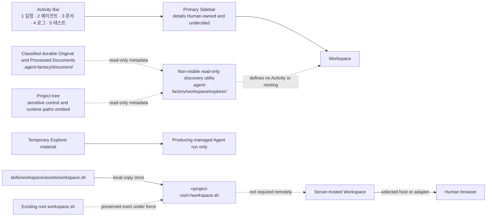

# Diagrams

Use Mermaid source as the default maintained representation for diagrams. Use
Mermaid.js only as the Human-facing SVG renderer under the dependency and
runtime boundaries in `libraries.md`.

## Diagram type routing

- Read `diagrams/erd.md` for entity, attribute, key, relationship, and
  cardinality models.
- Read `diagrams/behavior.md` for game monster, NPC, and boss behavior patterns.
- Read `diagrams/sequence.md` for time-ordered interactions among actors or
  systems.

Choose one diagram type for the relationship being explained. Split a diagram
when it mixes data structure, decision behavior, and temporal interaction so
heavily that its primary reading direction becomes unclear. A diagram is a
projection of grounded knowledge; it does not by itself establish runtime
behavior, data authority, acceptance, or implementation completion.

Every authored diagram must include a concise `accTitle` and an `accDescr` that
communicates the important relationship without relying on color or geometry.
Keep labels stable and domain-specific, and keep the source readable in version
control.

## Agent Factory core sources

These Mermaid sources are the AI-readable equivalents of the important visual
relationships rendered with semantic HTML and inline SVG in the paired Korean
browser document. Keep labels and relationships aligned when either
representation changes.

## Document types


## Core capability topology



## Agent engineering stack



## Paired representation alignment



## Current implementation relationships



## Project Skill naming



This relationship applies to newly named Skill identities where the owning
context requires the two-part form. Existing accepted identities are
preserved; it does not authorize bulk renaming.

## Skill ownership



## Storage-independent document roles

```mermaid
flowchart LR
    accTitle: Storage-independent Document roles
    accDescr: Logical Document types and roles may use the local adapter or an explicitly resolved alternative while every adapter preserves the same authority and safety requirements.
    Roles[Logical Document types<br/>and document roles]
    Roles --> Local[Current/default local adapter<br/>.agent-factory/document/{original, processed, specification}]
    Roles --> Alternative[Explicitly resolved alternative<br/>project server, external store,<br/>mounted filesystem, configured backend]
    Requirements[Provenance, authority, isolation,<br/>alignment, accessibility, security]
    Requirements -. required for every adapter .-> Local
    Requirements -. required for every adapter .-> Alternative
    Alternative -. integration policy unresolved .-> Decisions[Configuration, identity, sync/conflicts,<br/>authentication, availability, caching]
```

## Human-facing Workspace shell and launcher


