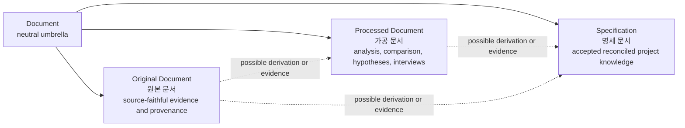
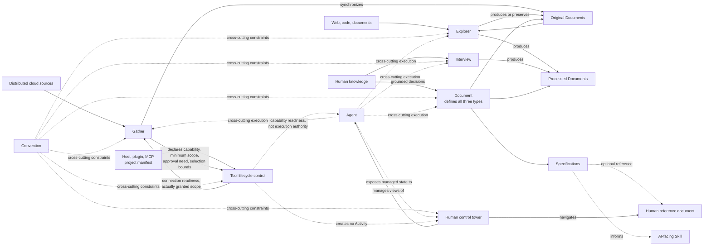
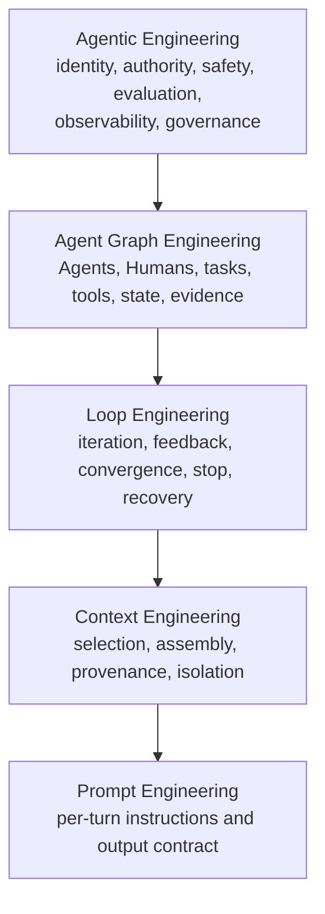
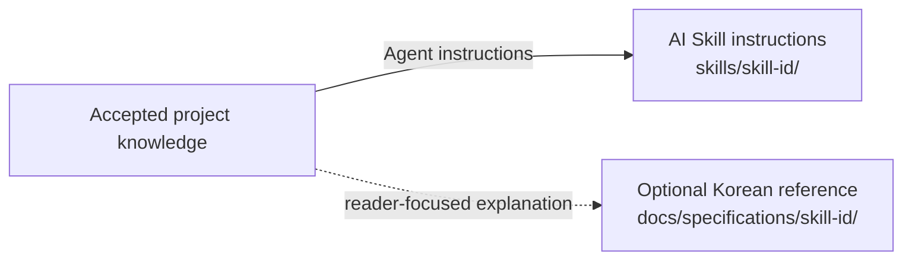
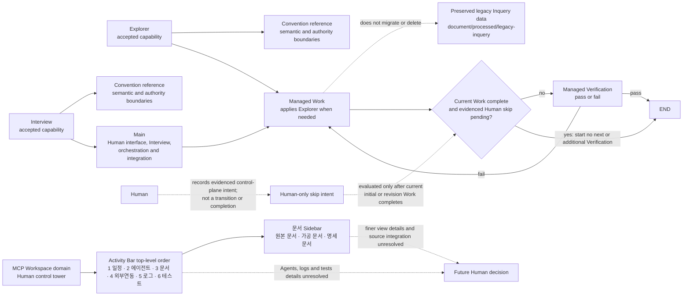
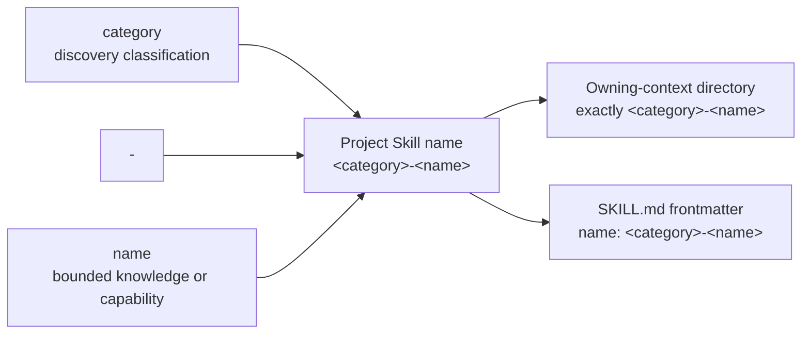
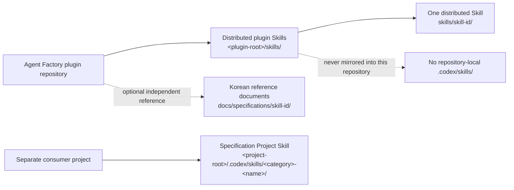
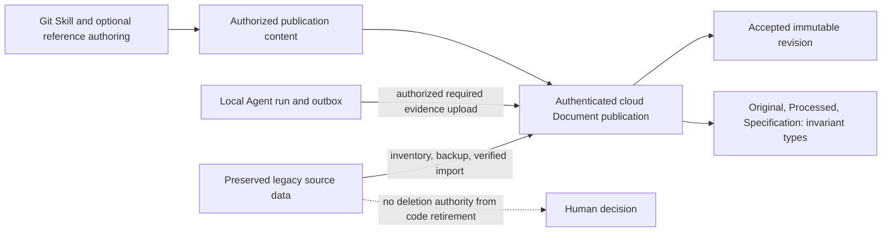
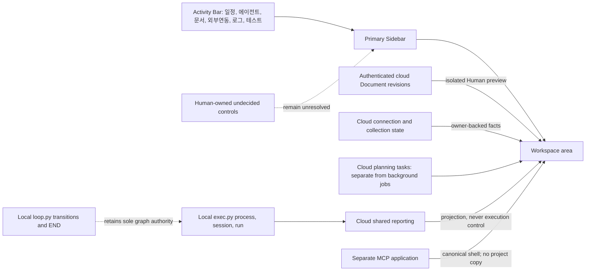

# Diagrams

Use Mermaid source as the default maintained representation for diagrams. Use
Mermaid.js only as the Human-facing SVG renderer under the dependency and
runtime boundaries in `libraries.md`.

## Diagram type routing

- Read `diagrams/erd.md` for entity, attribute, key, relationship, and
  cardinality models.
- Read `diagrams/behavior.md` for game monster, NPC, and boss behavior patterns.
- Read `diagrams/sequence.md` for time-ordered interactions among actors or
  systems.

Choose one diagram type for the relationship being explained. Split a diagram
when it mixes data structure, decision behavior, and temporal interaction so
heavily that its primary reading direction becomes unclear. A diagram is a
projection of grounded knowledge; it does not by itself establish runtime
behavior, data authority, acceptance, or implementation completion.

Every authored diagram must include a concise `accTitle` and an `accDescr` that
communicates the important relationship without relying on color or geometry.
Keep labels stable and domain-specific, and keep the source readable in version
control.

## Agent Factory core sources

These Mermaid sources explain Agent Factory relationships. Use diagrams when they clarify a relationship. Keep any rendered diagram faithful to its own source and provide accessible fallback meaning.

## Document types

## Core capability topology

## Agent engineering stack

## Skill and reference documents

## Current implementation relationships

## Project Skill naming

This relationship applies to newly named Skill identities where the owning
context requires the two-part form. Existing accepted identities are
preserved; it does not authorize bulk renaming.

## Skill ownership

## Storage-independent document roles

## Human-facing cloud Workspace

